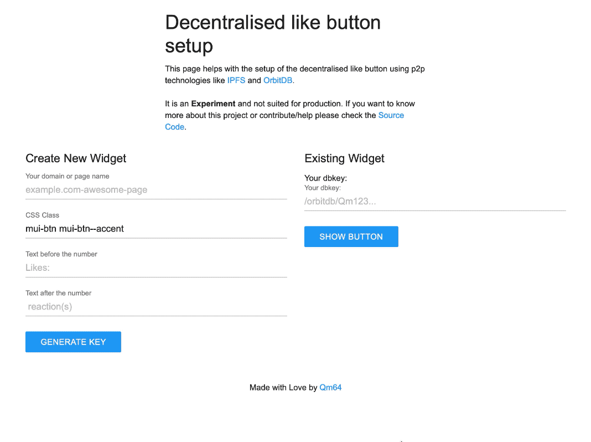

<br />
<p align="center">
  <h3 align="center">dLike</h3>

  <p align="center">
    A simple Like Button / HTML Widget that uses IPFS and OrbitDB to sync data
    without using central servers. [Experimental]
    <br />
    <br />
    <a href="https://dlike.qm64.tech/">View Demo</a>
    ·
    <a href="https://qm64.tech/posts/202006-ipfs-orbitdb-likes/">Read More</a>
  </p>
</p>


<!-- TABLE OF CONTENTS -->
## Table of Contents

* [About the Project](#about-the-project)
* [Getting Started](#getting-started)
  * [Prerequisites](#prerequisites)
  * [Installation](#installation)
* [License](#license)
* [Contact](#contact)

## About The Project

[](https://dlike.qm64.tech/)


This widget uses IPFS and OrbitDB to have a fully decentralised and p2p 
"Like button" in the browser without any servers or FaaS. 
**Important Note**: This project is just an experiment and far from being 
production ready! 

This is a [Qm64](https://qm64.tech) experiment!

## Getting Started
To run the software locally you don't need any configuration or download. You 
can browse to [the setup page](https://dlike.qm64.tech/) and copy your HTML
snippet. On the setup page you can also create a widget or load an existing one 
by inserting the _dbkey_/Database Address.

If you instead want to modify the source code and run it locally you can follow
these steps.

### Prerequisites
To run this software you need:

- [Make](https://www.gnu.org/software/make/)
- [NodeJS](https://nodejs.org/en/)
- [yarn](https://yarnpkg.com/)

### Installation
 
1. Clone the repo
```sh
git clone https://gitlab.com/Qm64/dlike.git
```
2. Run it locally
```sh
make run
```

This will run a local development server. Open a browser and visit 
[localhost:9000](http://localhost:9000) to see the setup page and test the 
changes.

<!-- LICENSE -->
## License

Distributed under the GPLv3 License. See `LICENSE` for more information.


<!-- CONTACT -->
## Contact
Lorenzo Setale - [@koalalorenzo](https://twitter.com/koalalorenzo) - [Website](https://setale.me/)

* Project Blog Post: [https://qm64.tech/posts/202006-ipfs-orbitdb-likes/](https://qm64.tech/posts/202006-ipfs-orbitdb-likes/)
* Project Link: [https://gitlab.com/Qm64/dlike](https://gitlab.com/Qm64/dlike)